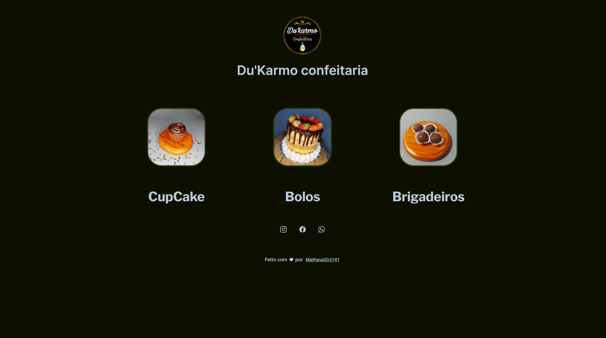

<h1 align="center"> DU'Karmo Confeitaria </h1>

Cardápio digital feito para a empresa Du'Karmo Confeitaria

  <a href="#-tecnologias">Tecnologias</a>&nbsp;&nbsp;&nbsp;|&nbsp;&nbsp;&nbsp;
  <a href="#-projeto">Projeto</a>&nbsp;&nbsp;&nbsp;|&nbsp;&nbsp;&nbsp;
  <a href="#-layout">Layout</a>&nbsp;&nbsp;&nbsp;|&nbsp;&nbsp;&nbsp;
  <a href="#memo-licença">Licença</a>

  

 

  

##  Tecnologias

Esse projeto foi desenvolvido com as seguintes tecnologias:

- HTML e CSS
- JavaScript
- Git e Github

## 💻 Projeto

Cardápio digital feito para a empresa Du'Karmo Confeitaria , visando uma maior facilidade para os clientes terem acesso a todos os tipos de bolos e doces feitos pela empresa.

- [Visite o projeto online](https://matheusgrz141.github.io/Du-Karmo-Confeitaria)

## :memo: Licença

Esse projeto está sob a licença MIT.